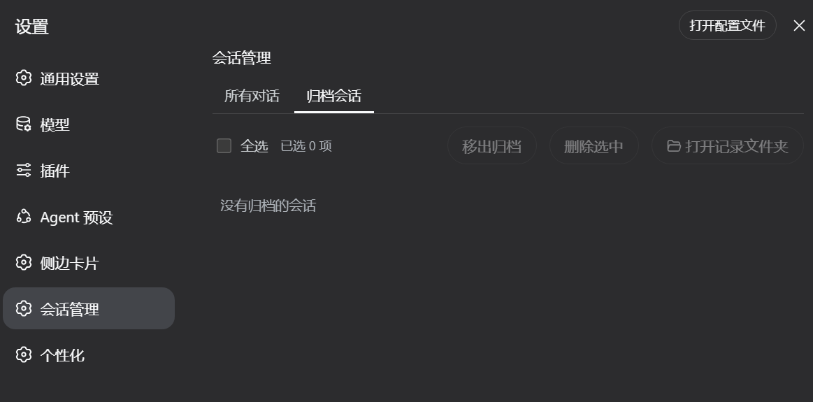
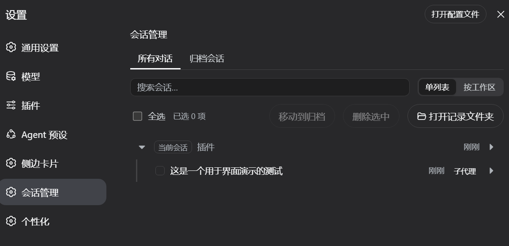
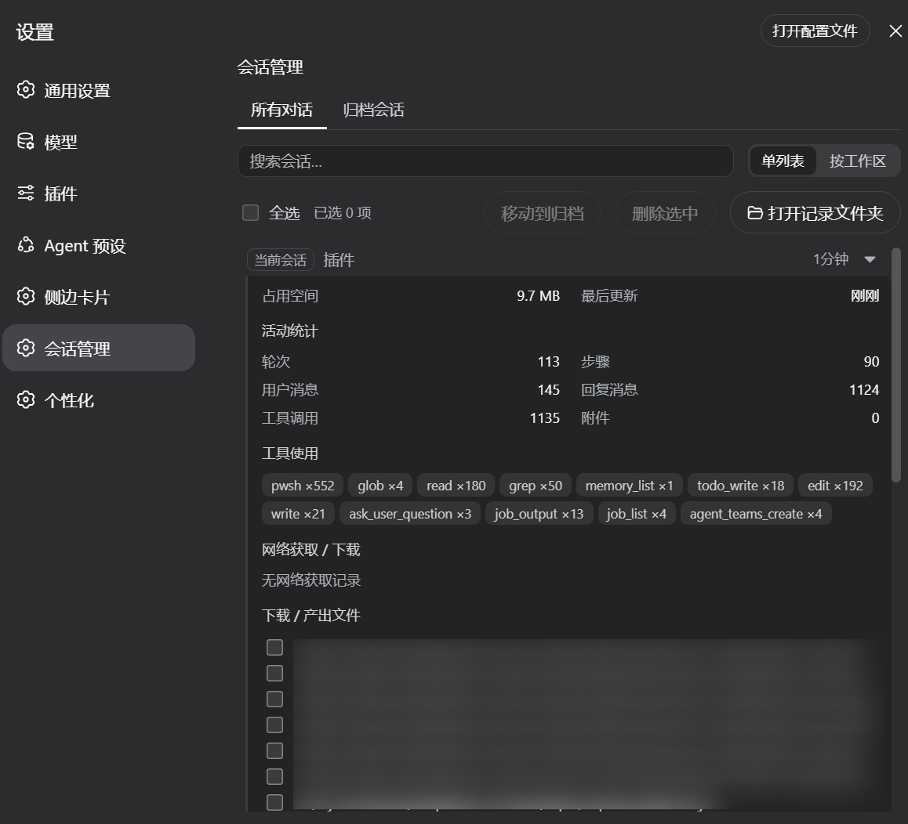

# dsh-archived-sessions（DSH 会话管理）

<div align="center">

[English](README.md) | [中文](README.zh.md)

</div>

一个 DSH Web 插件：在「设置」中提供**会话管理**，统一管理本机上的所有对话。

## 功能

- **双标签页**：**所有对话**（未归档）与**归档会话**
- **视图切换**：**单列表**或**按工作区分组**（无工作区归属的会话兜底归入「未分组」）
- 按标题 + 相对时间浏览对话，最近的排在最前
- **搜索框**：按标题或 ID 实时过滤会话列表
- 勾选 / 拖动批量勾选 / 全选 / 批量**归档**（记录保留）/ 批量**删除**（永久删除，带确认弹窗）
- 归档页支持**移出归档**（回到所有对话）
- **打开记录文件夹**按钮：在系统文件管理器中打开所选会话的记录目录，跨平台（`explorer` / `open` / `xdg-open`）
- 每行可展开详情（默认收起）：占用空间、最后更新、活动统计（轮次、步骤、消息数、工具调用分布、fetch 记录）、产出/下载文件、父会话与子会话（分叉）
- **子代理会话**嵌套显示在父会话下方（缩进 + 「子代理」徽标）；父会话被删除或缺失时自动浮出为顶层行
- **删除父会话不会级联**：子代理、分叉、下载/产出文件均保留，除非你显式勾选它们——避免误删
- 当前打开的会话显示「当前会话」徽标，且**不可删除**

## 截图

<div align="center">
  
  
  <p>归档会话视图 / 子代理会话嵌套在父会话下</p>
</div>

<div align="center">
  
  
  <p>批量删除确认 / 详情面板（含活动统计）</p>
</div>

## 安装

### 方式一：直接 tarball 安装

```sh
dsh plugin --profile web add https://codeload.github.com/Zephyr-vibe/dsh-archived-sessions/tar.gz/refs/heads/main
```

如果 pnpm 拦截构建脚本，在命令末尾加 `--ignore-scripts`：

```sh
dsh plugin --profile web add https://codeload.github.com/Zephyr-vibe/dsh-archived-sessions/tar.gz/refs/heads/main --ignore-scripts
```

### 方式二：让 agent 安装

告诉你的 DSH 智能体：

```text
帮我把这个项目安装为插件：https://github.com/Zephyr-vibe/dsh-archived-sessions
```

agent 会下载项目、放入 profile 的 `node_modules` 并注册到 `dsh.profile.bundles`。

安装后重启 web 端，即可在「设置」中看到「会话管理」入口。

## 兼容性（零配置）

- **零配置**：会话目录按官方 DSH 布局（`$DSH_HOME/sessions/<project-key>/<session-id>/`）自动识别，无需核心补丁
- **归档 / 恢复**：基于官方 `archiveSession` 相同的 `registry` 状态原语实现
- **删除不级联**：只删除所选会话，子代理、分叉与文件均保留；运行中的会话拒绝删除（409）
- **API 仅信任本机请求**（127.0.0.1 / localhost / ::1）；仅使用官方公开 API（`workspaceRegistry`、`sessionPersistence`）

## 更新日志

### 0.1.2

- **搜索框**：按标题或 ID 实时过滤会话列表
- **详情面板活动统计**：轮次、步骤、用户/助手消息、工具调用分布与 fetch 记录
- **更安全的文件删除**：只能删除该会话的产出文件（拒绝目录），带确认弹窗与失败汇总
- 批量操作**分批执行**（每批 20 个）——选中数百会话不再压垮浏览器
- 父会话删除后，孤儿子代理会话在工作区视图仍可见
- 详情子会话不再重复列出；单个工作区异常不再阻塞整次删除
- 相对时间自动刷新；键盘（Tab + Enter/Space）选择；拖拽选择在窗口外释放不再卡住
- 打开记录文件夹支持无工作目录会话（`_no-cwd` 布局）；删除不存在的会话返回 404
- 详情响应有界（文件 ≤ 200、fetch ≤ 50），大会话保持流畅

### 0.1.1

- 子代理会话**默认折叠**，点击父行箭头展开/收起
- 子代理跟随父会话归入正确的**工作区分组**（不再落入「未分组」）
- 删除父会话**不再级联**：子代理、分叉与文件均保留，除非显式勾选
- 打开记录文件夹按钮；批量归档/恢复/删除带确认；当前会话保护
- 纯净 Harness **零配置**——仅使用官方 API，无核心补丁

### 0.1.0

- 首个版本：双标签（所有对话/归档会话）、单列表/按工作区视图、批量归档与删除、详情展开、子代理嵌套

## 许可证

MIT — © 2026 Zephyr-vibe
